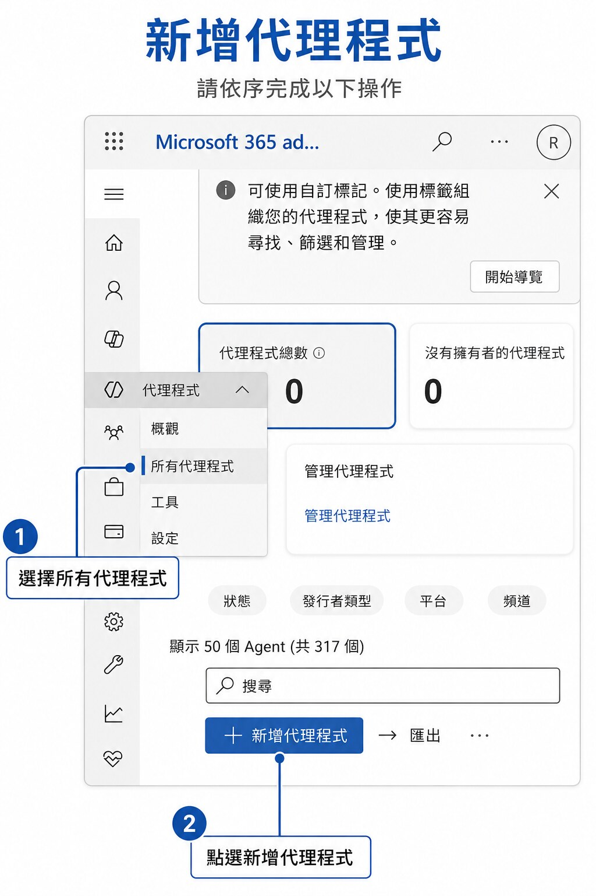
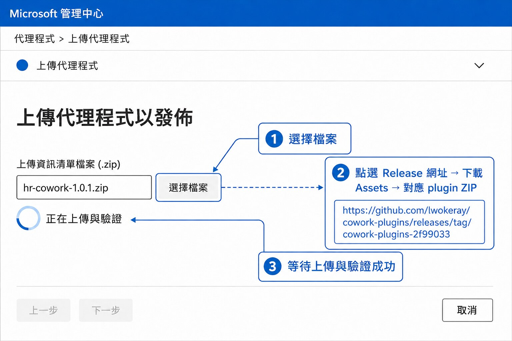
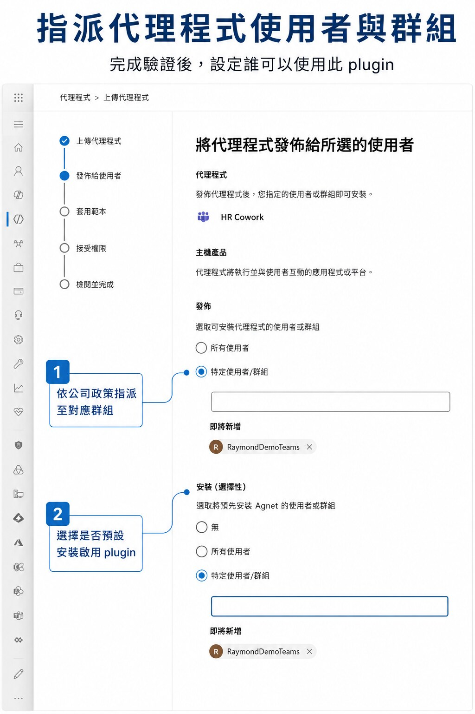
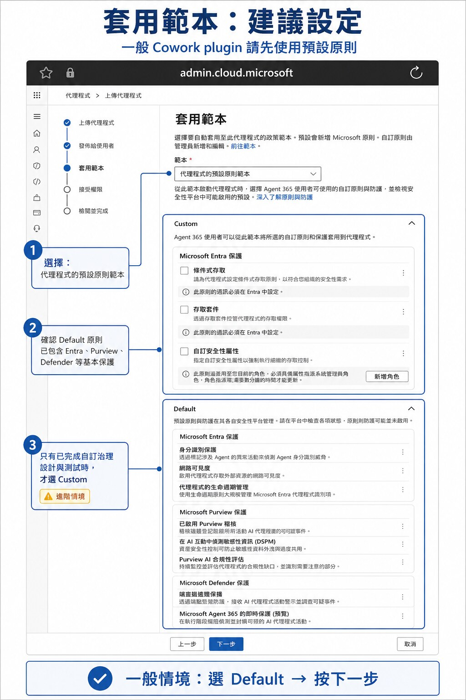
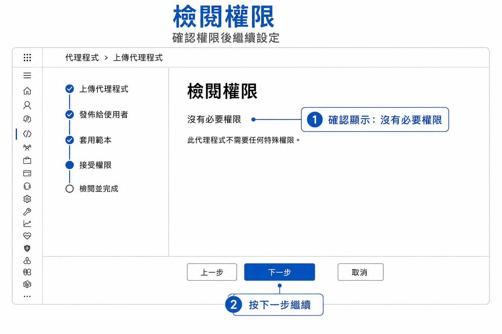
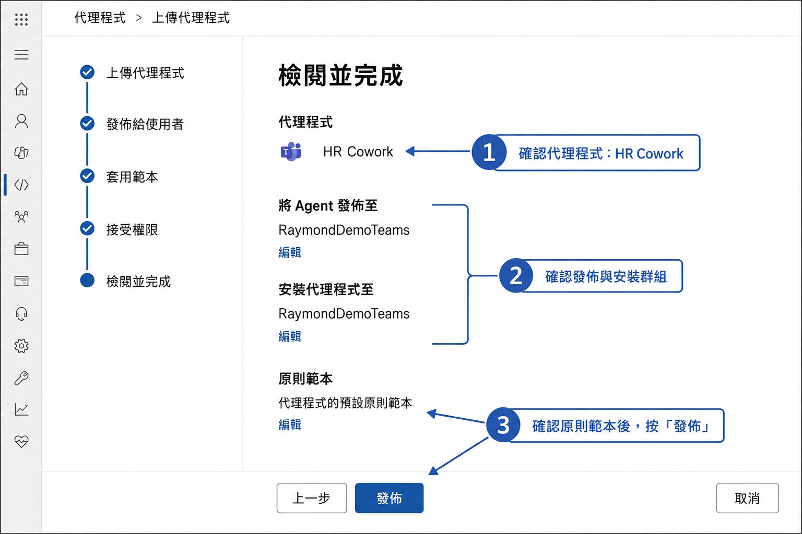
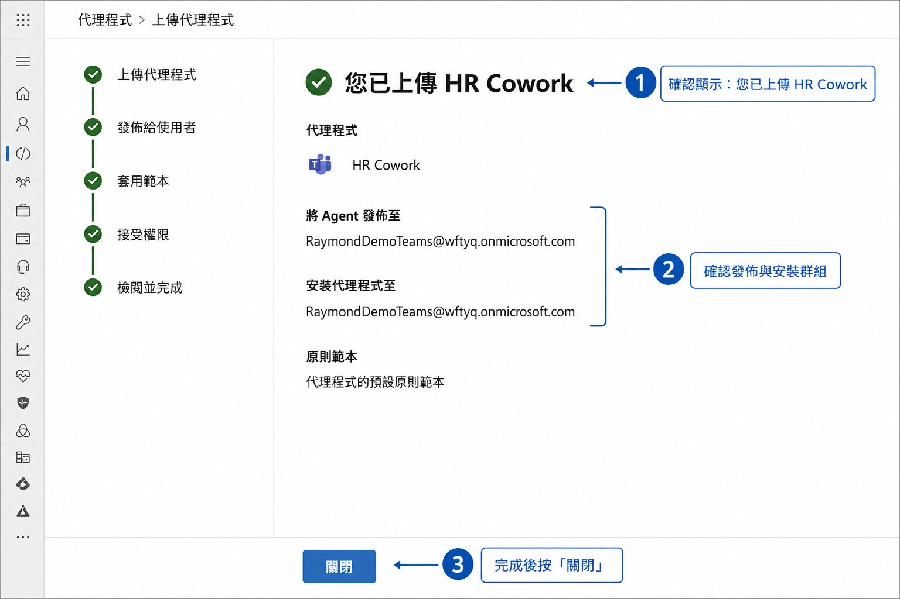
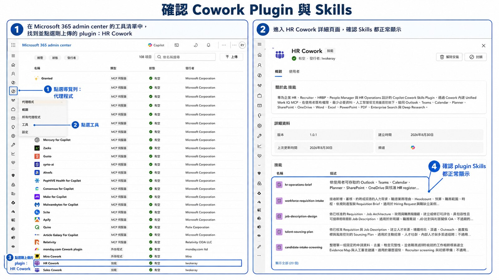
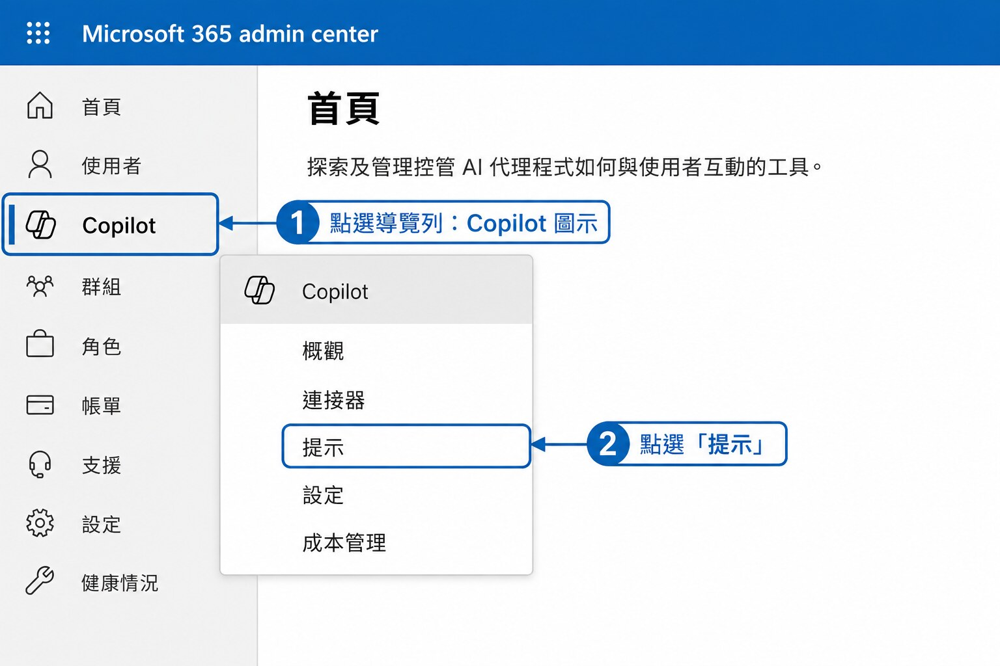
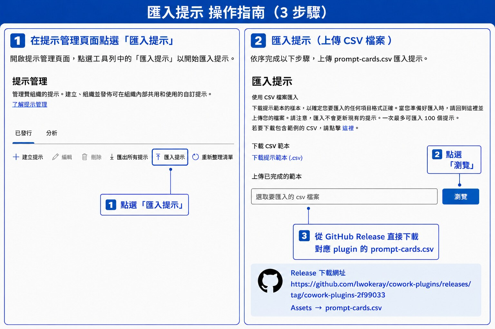

# Microsoft 365 Copilot Cowork Plugins

Microsoft 365 Copilot Cowork 的職能型 Plugin monorepo。每個 Plugin 依業務職能獨立封裝，包含可部署的 M365 Unified App Package、完整 Monolithic Skills、Prompt Cards 與驗證案例。

## Plugin Catalog

<!-- PLUGIN_CATALOG:START -->
| Plugin | Version | Skills | Status | Responsibility |
|---|---:|---:|---|---|
| [`sales-cowork`](plugins/sales-cowork/) | 3.1.0 | 18 | candidate | 企業銷售、商機、提案、商務審查、成交交接與續約擴展 |
| [`marketing-cowork`](plugins/marketing-cowork/) | 1.0.1 | 20 | candidate | 市場與受眾研究、品牌、Campaign、內容、Launch、成效與 Sales handoff |
| [`finance-cowork`](plugins/finance-cowork/) | 1.0.1 | 15 | candidate | 企業結帳、會計、FP&A、Treasury、財務分析、稽核與內控 |
| [`hr-cowork`](plugins/hr-cowork/) | 1.0.1 | 20 | candidate | 招募、員工生命週期、HR operations、人才發展與人力規劃 |
| [`pm-cowork`](plugins/pm-cowork/) | 2.0.1 | 16 | candidate | 產品與專案 intake、規格、規劃、交付、風險、治理與成果檢視 |
| [`it-operations-cowork`](plugins/it-operations-cowork/) | 1.0.1 | 17 | candidate | Identity、Endpoint、M365、Cloud、Network、Security、Change 與 IT Operations |
| [`it-helpdesk-cowork`](plugins/it-helpdesk-cowork/) | 2.0.1 | 12 | candidate | Dynamics 365 Customer Service IT case intake、troubleshooting、communication 與 escalation |
<!-- PLUGIN_CATALOG:END -->

## Download

從 [Latest Release](https://github.com/lwokeray/cowork-plugins/releases/latest) 直接下載所需職能的 Plugin ZIP 與對應 Prompt Card CSV。

## 安裝與匯入流程

所有安裝檔與 Prompt Cards 均從 [GitHub Release](https://github.com/lwokeray/cowork-plugins/releases/tag/cowork-plugins-2f99033) 的 **Assets** 直接下載。

### 0. 進入上傳畫面

在 Microsoft 365 admin center 左側導覽列點選「代理程式」圖示，選擇「所有代理程式」，再點選「新增代理程式」。



### 1. 上傳 Plugin

從 Release 下載對應職能的 Plugin ZIP，於 Microsoft 365 admin center 選擇「代理程式」→「新增代理程式」→「選擇檔案」，等待上傳與驗證成功。



### 2. 指派群組與安裝

依公司政策將 Plugin 發佈至對應使用者或群組；如需預設安裝啟用，可在「安裝（選擇性）」指定群組。



### 3. 套用原則範本

一般 Cowork Plugin 選擇預設原則範本；僅在已完成自訂治理設計與測試時才選 Custom。



### 4. 檢閱權限並發佈

確認需要的權限後按「下一步」，檢閱 Plugin、群組與原則範本，最後按「發佈」。





### 5. 確認上傳完成與 Skills

確認顯示「您已上傳」，再從導覽列進入「代理程式」→「工具」，開啟剛上傳的 Plugin，確認 Skills 清單正常顯示。





### 6. 匯入 Prompt Cards

進入「Copilot」→「提示」→「匯入提示」→「瀏覽」，從 Release 的 **Assets** 下載並選取對應 Plugin 的 `prompt-cards.csv`。





## Plugin Structure

每個 Plugin 使用相同結構：

```text
plugins/<domain>-cowork/
├── manifest.json
├── color.png
├── outline.png
├── README.md
├── CHANGELOG.md
├── assets/
│   └── icon-source.yaml
├── skills/
│   └── <skill-name>/
│       └── SKILL.md
├── prompts/
│   ├── prompt-cards.yaml
│   ├── prompt-cards.md
│   └── prompt-cards.csv
└── evals/
    ├── routing.json
    ├── behavior.json
    └── tenant-checklist.md
```

部署套件包含 `manifest.json`、`color.png`、`outline.png`、`skills/`，以及使用 Connector 時才需要的 `tools/`。README、Prompt Cards、evals 與 icon source metadata 僅供 Repository 維護與驗證。

## Repository Layout

```text
.github/workflows/    Pull Request 驗證與 Release workflow
docs/standards/       Repository、Plugin、Skill、Prompt Card、icon、eval 與發布規範
plugins/              各職能 Cowork Plugin source
scripts/              驗證、Prompt Card 同步、Catalog 產生與建置工具
tests/                Repository tooling tests
catalog.yaml          Plugin 清單、版本來源與責任邊界
requirements-dev.txt  驗證與建置相依套件
```

## Prompt Cards

- `prompt-cards.yaml`：唯一編輯來源。
- `prompt-cards.md`：供人工檢閱。
- `prompt-cards.csv`：UTF-8 BOM 格式，供 Microsoft 365 Copilot 匯入。
- 每個 Skill 必須對應一張 Prompt Card，routing eval 使用相同 Prompt。

同步指定 Plugin 的 Prompt Cards：

```bash
python scripts/prompt_cards.py plugins/sales-cowork --write
```

## Validate

```bash
python -m pip install -r requirements-dev.txt
python scripts/validate_repo.py
python -m unittest discover -s tests -v
```

驗證涵蓋 manifest v1.28、GUID、SemVer、icons、Skill frontmatter 與內容契約、Prompt Card 覆蓋、routing、behavior、tenant acceptance、Catalog，以及部署 ZIP 結構。

## Build

```bash
python scripts/build_plugin.py sales-cowork
```

建置結果輸出至 `build/`：

```text
build/<plugin-id>-<version>.zip
build/<plugin-id>-<version>.sha256
```

ZIP 根目錄只包含部署所需檔案；建置結果不提交至 Repository。

## Release

在 GitHub Actions 執行 `Release Cowork Plugin` workflow，輸入 `plugins/` 下的 Plugin id。Workflow 會先驗證完整 Repository，再建立 ZIP、SHA-256 與 GitHub Release。

Release tag 格式：

```text
<plugin-id>-v<version>
```

## Standards

- [Repository standard](docs/standards/repository-standard.md)
- [Plugin package standard](docs/standards/plugin-standard.md)
- [Skill authoring standard](docs/standards/skill-standard.md)
- [Prompt Card standard](docs/standards/prompt-card-standard.md)
- [Icon standard](docs/standards/icon-standard.md)
- [Evaluation standard](docs/standards/evaluation-standard.md)
- [Release standard](docs/standards/release-standard.md)
