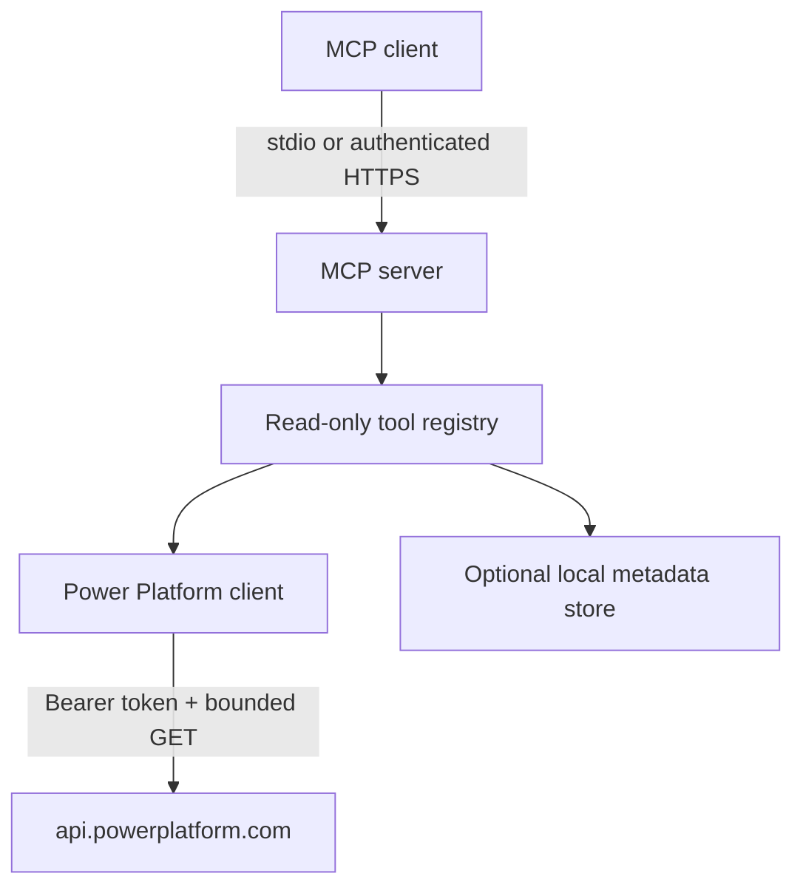

# Architecture

HTTP mode requires an API key, validates optional exact Origins, limits request size, and creates one `McpServer` plus `StreamableHTTPServerTransport` per initialized session. Requests with an unknown or missing session are rejected. `GET`/`DELETE /mcp` return 405; health is isolated at `GET /healthz`.

The Power Platform client accepts only the configured HTTPS origin, applies request timeout and response-size limits, performs bounded retry for safe GET requests, and redacts/limits MCP output. A continuation URL cannot redirect credentials to another origin.

The local Store is a metadata overlay. It can persist inventory and governance labels atomically, but it cannot change flow definitions, owners, DLP, solution membership, alerts, or Microsoft audit records.

## Trust boundaries

- MCP caller input, tenant metadata, connector descriptions and flow content are untrusted data.
- API keys and Power Platform tokens stay in process configuration or secret files and are never returned by tools.
- This version is read-only upstream. Local Store writes are clearly separated from Power Automate changes.
- Each production deployment should isolate one tenant/identity and enforce TLS, least privilege, ingress rate limiting, egress allowlisting and centralized audit logs.
