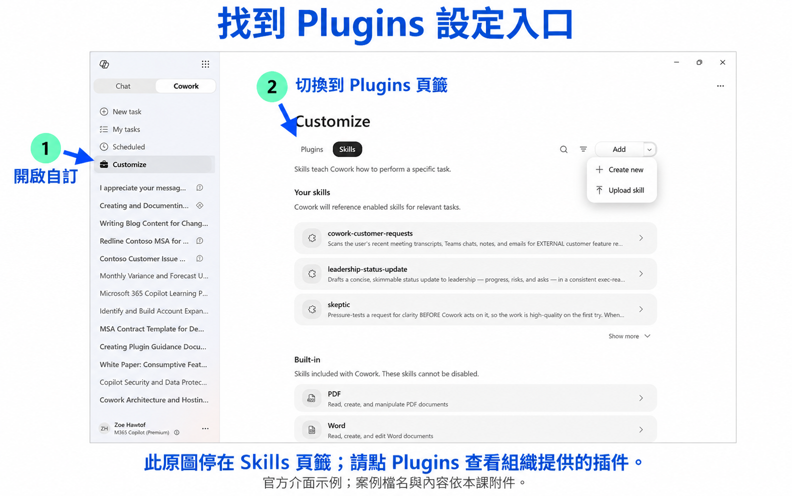
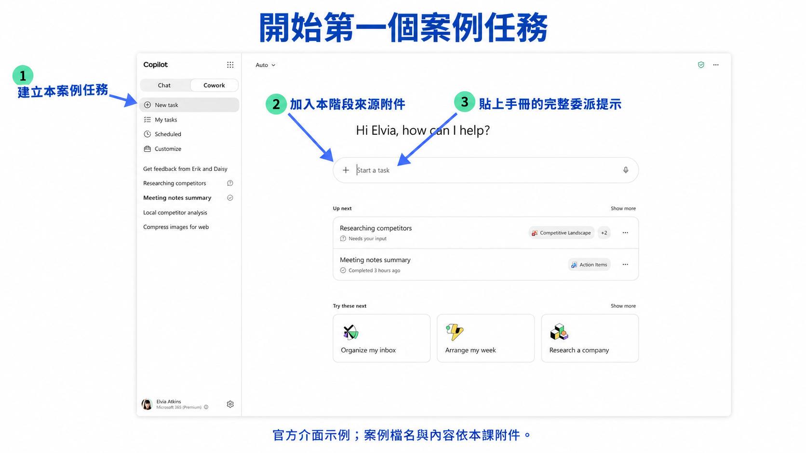
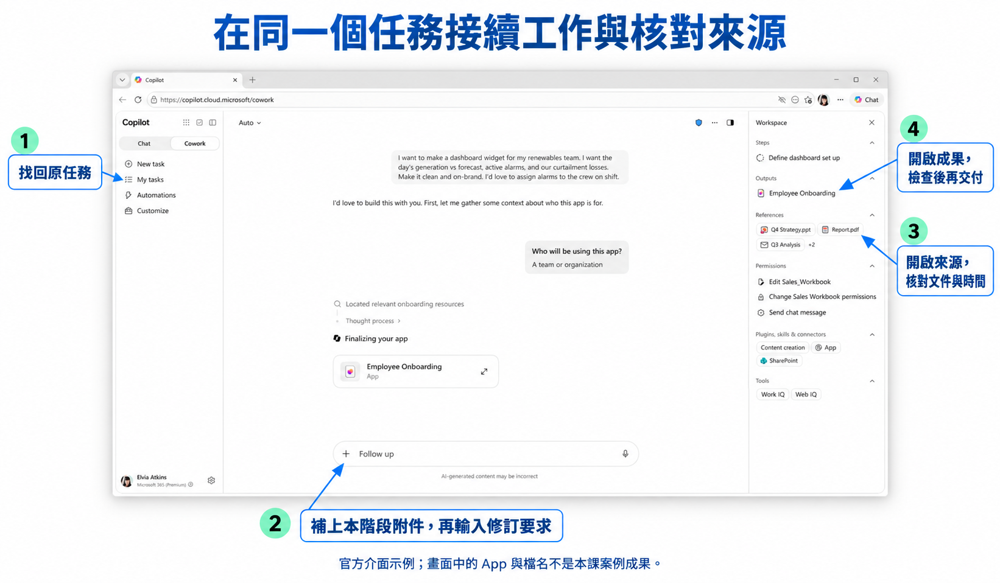
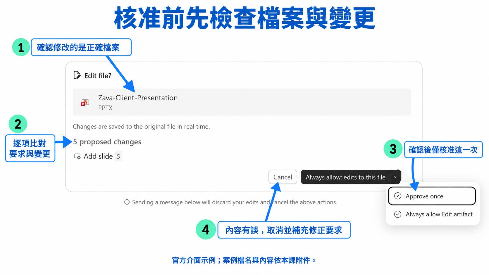

# HR Cowork 從核准職缺到新人順利到職｜連續圖解實作

每一步依序呈現工作事件、完整來源、操作圖、可複製提示、預期結果與修訂方法。照本文往下操作即可。整課沿用同一個 Cowork 任務。

## 接下這個工作

你的角色：澄岳數位 HR 陳思妤。

交付主管要補一位雲端工程師，讓年底兩個專案有人支援。你負責確認職缺、協調面試與到職；主管負責選才，薪酬由核准人決定，IT 依正式到職資料準備帳號設備。候選人中途要求改到職日，你必須讓面試決策、Offer 與到職清單維持一致。

案例公司、人員與全部業務紀錄均為合成教學資料。操作圖採 Microsoft 官方實際畫面加註，圖中的示例案件與檔名以本課指定值替換。建議預留 150 分鐘完成案例與實作。

## 準備好就開始

1. 下載並解壓本課 [練習資料.zip](練習資料.zip)；附件在 **data**，依序使用 S01 至 S08 資料夾。這些 Word 與 CSV 用來上傳 Cowork，原文與明細也會直接顯示在每一步。
2. 登入講師提供的工作／學校帳戶，進入 **Cowork**，點 **Customize → Plugins**，確認 **hr-cowork** 可使用。若尚未出現，請講師確認帳戶與部署範圍。
3. 準備完成後，從下方 S01 建立任務；之後在同一任務接續新事件。每步只加入當步指定附件。

<figure><figcaption>操作圖：進入 Customize，切換到 Plugins 頁籤。Microsoft 官方實際畫面加註；圖中檔名為官方示例，實作請選本步指定檔名。</figcaption></figure>

本課交付完整檔案與可審閱草稿。實際系統寄送、寫入或設備操作須有對應連線與授權；課堂提供的來源紀錄代表案例中已發生的事情。

## S01｜把職缺標準變成證據清單

現在情境時間是 2026/10/05 17:00 台北時間。僅使用此時點已發生的來源；較晚事件暫不採用。

你現在收到下列工作資料，先讀事件與原文，再按圖委派這一步。

**D01_職缺核准原件與三份履歷.docx｜完整原文**

> #### 雲端工程師職缺核准
>
> 文件ID：H-2607
>
> 時間（台北）：2026/10/05 09:00
>
> 文件類型：職缺申請單
>
> 建立／寄件人：許文傑
>
> 收件／參與人：陳思妤
>
> 用人需求：雲端工程師一名，台北，交付團隊。年底兩個 Microsoft 365 專案需要有人按核准計畫完成設定、驗證及問題交接。直接主管許文傑。
> 編制與職缺預算於 10/05 批准，薪酬條件另案審批。本職缺必要能力：有 Microsoft 365 導入實作證據，能留下排錯及交接文件，能閱讀英文技術文件。英文口說可於到職後培養，不應寫成必須流利。
> 主要工作：依交付計畫執行已批准設定，使用測試帳號驗證權限，保留操作前後證據，將未解問題交給負責人。工作完成以可追溯驗證及完整交接判斷。
> 面試請使用相同必要條件，問候選人本人負責部分、如何驗證及曾碰到的問題。不新增年齡、性別、照片、婚姻或未核准年資門檻。
>
>
> #### 周柏宇 履歷與專案經驗
>
> 文件ID：C-101-CV
>
> 時間（台北）：2026/10/05 10:00
>
> 文件類型：履歷
>
> 建立／寄件人：周柏宇
>
> 收件／參與人：陳思妤
>
> 應徵職缺 H-2607。希望從 Microsoft 365 維運與專案執行累積交付能力。
> 工作經歷：2023/07–2026/09 雲端服務工程師。日常處理 Teams 與 SharePoint 問題，配合專案主管執行站台與群組設定、整理驗證紀錄。
> 專案一：80 人 Teams 導入。我負責依名單確認使用者與群組，配合測試頻道可見性，記錄未完成項。會議原則由資深工程師決定，我沒有負責整體架構。
> 專案二：採購 SharePoint 協作站台。我依批准範圍建立文件庫並設定群組，使用內外部測試帳號比對可見資料。曾發現測試者屬於多個群組，先釐清成員關係再驗證。
> 作品附件：交接節錄列出站台目的、群組負責人、驗證帳號角色、通過項目及兩筆待查問題；沒有保留真實帳號或客戶網址。
> 自述工具：Teams、SharePoint、Entra 管理基本操作。未附英文技術文件閱讀作品。
>
> 作品一／交接紀錄節錄（候選人提供）
> 站台用途：採購文件往來。資料owner：採購主管；群組批准人：資訊主管。
> 測試A：以內部採購角色上傳「作業說明v2」，同組同仁能開啟，外部供應商角色無法看到內部草稿。結果通過。
> 測試B：供應商A角色能看A共用區，無法開啟B共用區。第一次測試帳號因誤加其他群組看到多餘內容，回報批准人核對成員後重測通過。
> 未完成一：兩份檔案沒有owner，保留於待確認區，由採購主管指派。未完成二：外部窗口尚未回覆測試時段，由專案PM追蹤。
> 交接方式：將測試角色、觀察、待辦及接受人記在清單，沒有把送出清單就標為接受完成。
>
>
> #### 林芷安 履歷與排錯作品
>
> 文件ID：C-102-CV
>
> 時間（台北）：2026/10/05 10:10
>
> 文件類型：履歷
>
> 建立／寄件人：林芷安
>
> 收件／參與人：陳思妤
>
> 應徵職缺 H-2607。三年服務台工作經驗，主要負責案件受理、使用者聯繫及二線交接。
> 工作內容：確認使用者受阻工作、記錄重現步驟、依已發布知識文章安排測試，持續追蹤二線回覆。處理過 Teams 加入會議、OneDrive 同步與郵件登入問題。
> 排錯作品：使用者回報桌面版登入失敗，我先確認瀏覽器是否可用，記錄發生時間與錯誤，將已做測試交二線。二線修正後再請使用者驗證，最後整理通知與結案紀錄。
> 我曾參加公司 Microsoft 365 專案會議並協助上線後支援，但履歷沒有說明我是否負責導入設定、權限配置或專案驗收。作品中有完整問題交接欄位，尚未附英文閱讀範例。
>
> 作品／服務台紀錄節錄（候選人提供）
> 09:10 使用者反映某文件無法開啟，當日報表需交主管。先記文件識別與錯誤時間，不要求使用者提供密碼。
> 09:18 核對後確認同一帳號能開其他同類文件，問題限單一文件。列可能原因為檔案本身或特定授權，尚不判根因。
> 09:30 將已做測試、結果與缺失資料交二線；以原owner確認的唯讀副本支援當日工作，原問題維持追蹤。
> 10:20 二線調整後由本人開啟原文件驗證成功。留下通知與使用者確認，再依規則結案。
> 本人責任為接案、測試記錄、交接與使用者驗證；並非二線設定調整。
>
>
> #### 黃冠廷 履歷與英文閱讀筆記
>
> 文件ID：C-103-CV
>
> 時間（台北）：2026/10/05 10:20
>
> 文件類型：履歷
>
> 建立／寄件人：黃冠廷
>
> 收件／參與人：陳思妤
>
> 應徵職缺 H-2607。曾在 Microsoft 365 專案中執行帳號清單核對、測試群組安排與導入前檢查。
> 專案工作表列本人負責：取得批准的人員範圍、建立測試用群組、核對授權狀態、回報設定差異。正式切換由專案負責人批准，我提供測試結果。
> 英文閱讀筆記節錄：先辨識文件中的 prerequisite 與 supported scope，再把設定步驟及可能影響整理為中文。閱讀到預覽功能時，會先確認環境是否可用，不直接套用到正式環境。
> 作品包含設定工作項目與英文閱讀筆記。履歷未附交付結案文件、未解問題如何承接的完整範例，請面試時補充。

### 現在照圖操作

<figure><figcaption>操作圖：新增任務、加入附件、送出第一個委派。Microsoft 官方實際畫面加註；圖中檔名為官方示例，實作請選本步指定檔名。</figcaption></figure>

1. 點 **New task**，在輸入框左側按 **＋ → Upload images and files**。
2. 在加號的上傳選項中選擇本課 **data/S01** 的下列檔案，等所有附件名稱出現、上傳完成：**D01_職缺核准原件與三份履歷.docx**。
3. 複製下方完整提示，貼入輸入區並送出。
4. 若 Cowork 問到來源沒有的資料，直接回覆「這個欄位尚無來源，請標為待確認，先完成其餘有依據的內容」。

### 委派內容｜job-description-design

```text
案例：HR Cowork 從核准職缺到新人順利到職；操作 S01。使用 job-description-design 的工作方法。
現在情境時間是 2026/10/05 17:00 台北時間。僅使用此時點已發生的來源；較晚事件暫不採用。
依 H-2607 核准內容修訂 JD，將必要條件與可培養能力分開。每項必要條件寫出可觀察的工作證據與面試確認方式。沒有提供的薪酬或年資門檻不要新增。
這一步新收到的附件：D01_職缺核准原件與三份履歷.docx。
建立可下載的 H01_職缺與面試標準.docx，內容必須包含：核准職缺、必要與可培養能力、每項工作證據、相同面試問題、禁止新增門檻。請提供完整正文或逐列資料，引用文件 ID 與時間。數值保留計算過程，資料不明列待確認。
本次只製作供人員審閱的成果草稿。若還缺資料，列出具體缺件及負責窗口，先完成可由現有證據支持的部分。
```

### 打開成果，直接用下表檢查

在 Cowork 的 **Outputs／輸出檔案區** 點開 **H01_職缺與面試標準.docx**。完整成果應包含：**核准職缺、必要與可培養能力、每項工作證據、相同面試問題、禁止新增門檻**。表內已列本步應出現的數值、狀態與判斷；引用標記供成果保留來源，檢查時直接使用下表已列的內容。

| 檢查項目 | 成果現在應呈現的內容 | 引用標記 |
| --- | --- | --- |
| M365 | 問本人設定、驗證與交接責任 | H-2607 |
| 英文 | 技術閱讀必要，口說可培養 | H-2607 |
| 薪酬年資 | 資料未載，不自行加門檻 | H-2607 |

### 完成後應能看到的內容

H-2607 JD 草稿
台北雲端工程師一名，主管許文傑。工作是依交付計畫執行 Microsoft 365 設定、留下驗證紀錄並交接問題。必要能力及證據：M365 導入的本人責任與實作紀錄；能呈現排錯與交接文件；能閱讀英文技術文件並說明操作風險。面試使用相同工作問題確認上述項目。英文口說列為可培養能力，不新增薪酬、年資或工作無關門檻。

參考措辭可以不同；請保留完整段落、必要欄位及逐筆資料。若只有幾句聊天回覆，請補送「請依指定檔名建立完整的可下載檔案，包含本步全部欄位、正文及明細」。

### 有錯就在同一任務修訂

以下修訂提示已帶入本步的實際檢查條件；需要修正時，直接貼入 Follow up。

```text
請修訂 H01_職缺與面試標準.docx，本步必須滿足下列條件：
- M365：問本人設定、驗證與交接責任。引用：H-2607。
- 英文：技術閱讀必要，口說可培養。引用：H-2607。
- 薪酬年資：資料未載，不自行加門檻。引用：H-2607。
請重新檢查上述條件及相關段落、數值與狀態。有誤的欄位保留原值、新值與來源時間；已正確部分保留。只使用本步截止時間以前、已在任務中提供的資料。輸出 H01_職缺與面試標準_v2.docx，並列出實際修改內容。
```

成果通過本步檢查後，在檔案預覽中使用 **Download／下載** 保存 **H01_職缺與面試標準.docx**（若有修訂，保存 v2）。接著往下進入下一個工作事件，繼續使用這個 Cowork 任務。

## S02｜履歷整理要保留缺口

現在情境時間是 2026/10/05 17:00 台北時間。僅使用此時點已發生的來源；較晚事件暫不採用。

這一步沒有新來信或附件。接續剛才的工作，用目前已知資訊完成 **H02_三人履歷證據表.xlsx**。

### 這一步沿用的原始工作紀錄

**H-2607｜2026/10/05 09:00｜許文傑 → 陳思妤｜雲端工程師職缺核准**

> 用人需求：雲端工程師一名，台北，交付團隊。年底兩個 Microsoft 365 專案需要有人按核准計畫完成設定、驗證及問題交接。直接主管許文傑。
> 編制與職缺預算於 10/05 批准，薪酬條件另案審批。本職缺必要能力：有 Microsoft 365 導入實作證據，能留下排錯及交接文件，能閱讀英文技術文件。英文口說可於到職後培養，不應寫成必須流利。
> 主要工作：依交付計畫執行已批准設定，使用測試帳號驗證權限，保留操作前後證據，將未解問題交給負責人。工作完成以可追溯驗證及完整交接判斷。
> 面試請使用相同必要條件，問候選人本人負責部分、如何驗證及曾碰到的問題。不新增年齡、性別、照片、婚姻或未核准年資門檻。

**C-101-CV｜2026/10/05 10:00｜周柏宇 → 陳思妤｜周柏宇 履歷與專案經驗**

> 應徵職缺 H-2607。希望從 Microsoft 365 維運與專案執行累積交付能力。
> 工作經歷：2023/07–2026/09 雲端服務工程師。日常處理 Teams 與 SharePoint 問題，配合專案主管執行站台與群組設定、整理驗證紀錄。
> 專案一：80 人 Teams 導入。我負責依名單確認使用者與群組，配合測試頻道可見性，記錄未完成項。會議原則由資深工程師決定，我沒有負責整體架構。
> 專案二：採購 SharePoint 協作站台。我依批准範圍建立文件庫並設定群組，使用內外部測試帳號比對可見資料。曾發現測試者屬於多個群組，先釐清成員關係再驗證。
> 作品附件：交接節錄列出站台目的、群組負責人、驗證帳號角色、通過項目及兩筆待查問題；沒有保留真實帳號或客戶網址。
> 自述工具：Teams、SharePoint、Entra 管理基本操作。未附英文技術文件閱讀作品。
>
> 作品一／交接紀錄節錄（候選人提供）
> 站台用途：採購文件往來。資料owner：採購主管；群組批准人：資訊主管。
> 測試A：以內部採購角色上傳「作業說明v2」，同組同仁能開啟，外部供應商角色無法看到內部草稿。結果通過。
> 測試B：供應商A角色能看A共用區，無法開啟B共用區。第一次測試帳號因誤加其他群組看到多餘內容，回報批准人核對成員後重測通過。
> 未完成一：兩份檔案沒有owner，保留於待確認區，由採購主管指派。未完成二：外部窗口尚未回覆測試時段，由專案PM追蹤。
> 交接方式：將測試角色、觀察、待辦及接受人記在清單，沒有把送出清單就標為接受完成。

**C-102-CV｜2026/10/05 10:10｜林芷安 → 陳思妤｜林芷安 履歷與排錯作品**

> 應徵職缺 H-2607。三年服務台工作經驗，主要負責案件受理、使用者聯繫及二線交接。
> 工作內容：確認使用者受阻工作、記錄重現步驟、依已發布知識文章安排測試，持續追蹤二線回覆。處理過 Teams 加入會議、OneDrive 同步與郵件登入問題。
> 排錯作品：使用者回報桌面版登入失敗，我先確認瀏覽器是否可用，記錄發生時間與錯誤，將已做測試交二線。二線修正後再請使用者驗證，最後整理通知與結案紀錄。
> 我曾參加公司 Microsoft 365 專案會議並協助上線後支援，但履歷沒有說明我是否負責導入設定、權限配置或專案驗收。作品中有完整問題交接欄位，尚未附英文閱讀範例。
>
> 作品／服務台紀錄節錄（候選人提供）
> 09:10 使用者反映某文件無法開啟，當日報表需交主管。先記文件識別與錯誤時間，不要求使用者提供密碼。
> 09:18 核對後確認同一帳號能開其他同類文件，問題限單一文件。列可能原因為檔案本身或特定授權，尚不判根因。
> 09:30 將已做測試、結果與缺失資料交二線；以原owner確認的唯讀副本支援當日工作，原問題維持追蹤。
> 10:20 二線調整後由本人開啟原文件驗證成功。留下通知與使用者確認，再依規則結案。
> 本人責任為接案、測試記錄、交接與使用者驗證；並非二線設定調整。

**C-103-CV｜2026/10/05 10:20｜黃冠廷 → 陳思妤｜黃冠廷 履歷與英文閱讀筆記**

> 應徵職缺 H-2607。曾在 Microsoft 365 專案中執行帳號清單核對、測試群組安排與導入前檢查。
> 專案工作表列本人負責：取得批准的人員範圍、建立測試用群組、核對授權狀態、回報設定差異。正式切換由專案負責人批准，我提供測試結果。
> 英文閱讀筆記節錄：先辨識文件中的 prerequisite 與 supported scope，再把設定步驟及可能影響整理為中文。閱讀到預覽功能時，會先確認環境是否可用，不直接套用到正式環境。
> 作品包含設定工作項目與英文閱讀筆記。履歷未附交付結案文件、未解問題如何承接的完整範例，請面試時補充。

### 現在照圖操作

<figure><figcaption>操作圖：在目前任務輸入後續指示，完成後開啟輸出檔案。Microsoft 官方實際畫面加註；圖中檔名為官方示例，實作請選本步指定檔名。</figcaption></figure>

1. 留在目前任務；前一步成果 **H01_職缺與面試標準.docx** 已在這段任務中，繼續使用 **Follow up** 輸入區。
2. 本步直接沿用任務中已提供的附件，無需重新上傳。
3. 複製下方完整提示，貼入輸入區並送出。
4. 若 Cowork 問到來源沒有的資料，直接回覆「這個欄位尚無來源，請標為待確認，先完成其餘有依據的內容」。

### 委派內容｜candidate-intake-screening

```text
案例：HR Cowork 從核准職缺到新人順利到職；操作 S02。使用 candidate-intake-screening 的工作方法。
現在情境時間是 2026/10/05 17:00 台北時間。僅使用此時點已發生的來源；較晚事件暫不採用。
依同一份 H-2607 標準，製作 C-101、C-102、C-103 的證據對照表。逐項列履歷原文依據、缺少證據與補問問題，交主管審查。不要排名或自動淘汰任何人。
這一步沒有新附件，請沿用前面已提供的來源。
以先前的 H01_職缺與面試標準.docx 接續工作，保留原資料與修訂痕跡。
建立可下載的 H02_三人履歷證據表.xlsx，內容必須包含：候選人、共同標準、履歷原文、來源ID、缺口、補問問題、主管待決。請提供完整正文或逐列資料，引用文件 ID 與時間。數值保留計算過程，資料不明列待確認。試算表請保留原始明細、分析或狀態提案分表；數值分析用可重算公式，不把結論貼成圖片。
本次只製作供人員審閱的成果草稿。若還缺資料，列出具體缺件及負責窗口，先完成可由現有證據支持的部分。
```

### 打開成果，直接用下表檢查

在 Cowork 的 **Outputs／輸出檔案區** 點開 **H02_三人履歷證據表.xlsx**。完整成果應包含：**候選人、共同標準、履歷原文、來源ID、缺口、補問問題、主管待決**。表內已列本步應出現的數值、狀態與判斷；引用標記供成果保留來源，檢查時直接使用下表已列的內容。

| 檢查項目 | 成果現在應呈現的內容 | 引用標記 |
| --- | --- | --- |
| C-101 | 兩次導入與交接；英文閱讀待確認 | C-101 |
| C-102 | 服務台經驗；導入本人責任待補 | C-102 |
| C-103 | 工作項目與英文筆記；交接例子待補 | C-103 |
| 結果 | 三人皆保留，不排名淘汰 | H-2607 |

### 完成後應能看到的內容

候選人證據對照
C-101 周柏宇：履歷稱參與兩次 Teams／SharePoint 導入，提供去識別交接文件，英文閱讀待確認。補問本人設定與驗證責任，並提供一段技術文件閱讀任務。
C-102 林芷安：三年服務台與排錯紀錄可支持排錯經驗，尚未證明 M365 導入責任。請補充實際負責的導入工作及英文閱讀證據。
C-103 黃冠廷：有 M365 工作項目及英文閱讀筆記，交接文件未提供。請補充交接範例及本人責任。三人都列出證據缺口，不排名、不自動淘汰，由主管決定下一步。

參考措辭可以不同；請保留完整段落、必要欄位及逐筆資料。若只有幾句聊天回覆，請補送「請依指定檔名建立完整的可下載檔案，包含本步全部欄位、正文及明細」。

### 有錯就在同一任務修訂

以下修訂提示已帶入本步的實際檢查條件；需要修正時，直接貼入 Follow up。

```text
請修訂 H02_三人履歷證據表.xlsx，本步必須滿足下列條件：
- C-101：兩次導入與交接；英文閱讀待確認。引用：C-101。
- C-102：服務台經驗；導入本人責任待補。引用：C-102。
- C-103：工作項目與英文筆記；交接例子待補。引用：C-103。
- 結果：三人皆保留，不排名淘汰。引用：H-2607。
請重新檢查上述條件及相關段落、數值與狀態。有誤的欄位保留原值、新值與來源時間；已正確部分保留。只使用本步截止時間以前、已在任務中提供的資料。輸出 H02_三人履歷證據表_v2.xlsx，並列出實際修改內容。
```

成果通過本步檢查後，在檔案預覽中使用 **Download／下載** 保存 **H02_三人履歷證據表.xlsx**（若有修訂，保存 v2）。接著往下進入下一個工作事件，繼續使用這個 Cowork 任務。

## S03｜排程與改期分開確認

現在情境時間是 2026/10/08 17:00 台北時間。僅使用此時點已發生的來源；較晚事件暫不採用。

你現在收到下列工作資料，先讀事件與原文，再按圖委派這一步。

**D02_面試安排與改期往來.docx｜完整原文**

> #### H2607 面試安排
>
> 文件ID：H-M008
>
> 時間（台北）：2026/10/08 09:30
>
> 文件類型：內部郵件
>
> 建立／寄件人：許文傑
>
> 收件／參與人：陳思妤；周承翰
>
> 請邀 C-101 與 C-103 面試，兩位都依同一份職缺必要條件進行。C-102 先補問 Microsoft 365 專案中本人執行的設定與驗證證據，現在不標示淘汰。
> 我與承翰均確認 C-101 的 10/12 10:00–11:00 可出席。C-103 原先回覆 10/12 14:00–15:00，我們也可配合；若有異動再確認。
> 請在邀請寫明面試目的、角色、需準備的去識別作品及台北時區。課程的實際測試邀請收件帳號另由講師提供，此份資料不授權寄信。
>
>
> #### C103 面試時間調整詢問
>
> 文件ID：H-M008B
>
> 時間（台北）：2026/10/08 16:20
>
> 文件類型：候選人郵件
>
> 建立／寄件人：黃冠廷
>
> 收件／參與人：陳思妤
>
> 您好，
> 原本 10/12 下午有臨時交接工作，請問可以改為 10/13 14:00–15:00 嗎？我仍願意參加，也會準備您提到的專案工作項目及交接方式。
> 這是我可配合的新時間，請再協助問面試官。若不方便，也請告訴我其他選項，我尚未認為原會議已經正式改期。
> 謝謝您的協助。

### 現在照圖操作

<figure><figcaption>操作圖：在目前任務輸入後續指示，完成後開啟輸出檔案。Microsoft 官方實際畫面加註；圖中檔名為官方示例，實作請選本步指定檔名。</figcaption></figure>

1. 留在目前任務；前一步成果 **H02_三人履歷證據表.xlsx** 已在這段任務中，繼續使用 **Follow up** 輸入區。
2. 在加號的上傳選項中選擇本課 **data/S03** 的下列檔案，等所有附件名稱出現、上傳完成：**D02_面試安排與改期往來.docx**。
3. 複製下方完整提示，貼入輸入區並送出。
4. 若 Cowork 問到來源沒有的資料，直接回覆「這個欄位尚無來源，請標為待確認，先完成其餘有依據的內容」。

### 委派內容｜interview-coordination

```text
案例：HR Cowork 從核准職缺到新人順利到職；操作 S03。使用 interview-coordination 的工作方法。
現在情境時間是 2026/10/08 17:00 台北時間。僅使用此時點已發生的來源；較晚事件暫不採用。
準備兩人的面試安排與邀請草稿。C-101 使用已共同確認時段；C-103 分開原時段與新請求，列需向面試官確認的事項。Email 待講師提供測試帳號，先不建立行事曆。
這一步新收到的附件：D02_面試安排與改期往來.docx。
以先前的 H02_三人履歷證據表.xlsx 接續工作，保留原資料與修訂痕跡。
建立可下載的 H03_面試安排與邀請.docx，內容必須包含：候選人、已確認時段、原時段、新請求、待確認對象、邀請與回覆全文。請提供完整正文或逐列資料，引用文件 ID 與時間。數值保留計算過程，資料不明列待確認。
本次只製作供人員審閱的成果草稿。若還缺資料，列出具體缺件及負責窗口，先完成可由現有證據支持的部分。
```

### 打開成果，直接用下表檢查

在 Cowork 的 **Outputs／輸出檔案區** 點開 **H03_面試安排與邀請.docx**。完整成果應包含：**候選人、已確認時段、原時段、新請求、待確認對象、邀請與回覆全文**。表內已列本步應出現的數值、狀態與判斷；引用標記供成果保留來源，檢查時直接使用下表已列的內容。

| 檢查項目 | 成果現在應呈現的內容 | 引用標記 |
| --- | --- | --- |
| C-101 | 10/12 10:00–11:00已共同確認 | H-M008 |
| C-103 | 新請求10/13 14:00–15:00待面試官確認 | H-M008B |
| 行事曆 | 收件帳號未提供，不建立會議 | H-M008 |

### 完成後應能看到的內容

面試安排草稿
C-101 使用雙方確認的 10/12 10:00–11:00 台北時間。邀請正文：您好，依雙方確認安排面試，將以本職缺相同工作標準討論 M365 實作、交接與技術文件閱讀。會議連結與測試收件帳號待講師提供，尚未建立行事曆。
C-103 原時段 10/12 14:00–15:00，改期請求 10/13 14:00–15:00 尚未經面試官確認。回覆正文：已收到改期需求，正在與面試官確認，新時間確定後另行通知。C-102 維持待補證據，沒有淘汰決定。

參考措辭可以不同；請保留完整段落、必要欄位及逐筆資料。若只有幾句聊天回覆，請補送「請依指定檔名建立完整的可下載檔案，包含本步全部欄位、正文及明細」。

### 有錯就在同一任務修訂

以下修訂提示已帶入本步的實際檢查條件；需要修正時，直接貼入 Follow up。

```text
請修訂 H03_面試安排與邀請.docx，本步必須滿足下列條件：
- C-101：10/12 10:00–11:00已共同確認。引用：H-M008。
- C-103：新請求10/13 14:00–15:00待面試官確認。引用：H-M008B。
- 行事曆：收件帳號未提供，不建立會議。引用：H-M008。
請重新檢查上述條件及相關段落、數值與狀態。有誤的欄位保留原值、新值與來源時間；已正確部分保留。只使用本步截止時間以前、已在任務中提供的資料。輸出 H03_面試安排與邀請_v2.docx，並列出實際修改內容。
```

成果通過本步檢查後，在檔案預覽中使用 **Download／下載** 保存 **H03_面試安排與邀請.docx**（若有修訂，保存 v2）。接著往下進入下一個工作事件，繼續使用這個 Cowork 任務。

## S04｜面試意見要對回工作證據

現在情境時間是 2026/10/14 17:00 台北時間。僅使用此時點已發生的來源；較晚事件暫不採用。

你現在收到下列工作資料，先讀事件與原文，再按圖委派這一步。

**D03_獨立面試紀錄及補件.docx｜完整原文**

> #### C101 許文傑獨立回饋
>
> 文件ID：H-IV101A
>
> 時間（台北）：2026/10/12 11:05
>
> 文件類型：面試官紀錄
>
> 建立／寄件人：許文傑
>
> 收件／參與人：陳思妤
>
> 提問：請說明如何確認 SharePoint 外部協作權限正確。
> 候選人回覆：先確認誰批准、哪些文件可對外、測試帳號角色；分別登入內部與外部測試帳號，測可見與不可見資料，記錄時間及結果。若群組重疊會先查成員來源。
> 觀察：可以解釋驗證流程，能區分操作完成與驗證通過。作品有未解問題及交接對象。仍需由技術面試確認英文文件理解，不以口說表現代替閱讀能力。
> 本份為個人觀察，尚非錄用決策，未與另一位面試官合併評分。
>
>
> #### C101 周承翰獨立回饋
>
> 文件ID：H-IV101B
>
> 時間（台北）：2026/10/12 11:10
>
> 文件類型：面試官紀錄
>
> 建立／寄件人：周承翰
>
> 收件／參與人：陳思妤
>
> 我詢問一次設定失敗的經驗。候選人描述先保存錯誤、比對變更前後與測試身分，不直接重做全部設定。這段回答支持排錯與交接能力。
> 英文閱讀目前只有自述，尚未看到本人如何辨識文件限制。我建議提供一段工作文件，要求用中文說明適用範圍、前置條件與一個操作風險，再完成必要條件判斷。
> 不因英文口說停頓判定不適任；本職缺口說能力屬可培養。此時尚未給出錄用結論。
>
>
> #### 英文文件閱讀工作示例
>
> 文件ID：H-SUP101
>
> 時間（台北）：2026/10/13 16:00
>
> 文件類型：候選人補件
>
> 建立／寄件人：周柏宇
>
> 收件／參與人：周承翰；許文傑
>
> 閱讀材料節錄：Before changing sharing settings, identify the site owner and verify the intended audience. Test access with separate internal and external accounts. A successful configuration update does not prove that every user can access the intended documents.
> 我的理解：先辨認站台負責人及批准的分享對象，再修改設定。必須用不同角色帳號驗證，不能只看管理員操作成功。
> 我會在操作單記錄批准範圍、原值、新值、測試角色與結果。如果外部帳號能讀到不該開放的文件，先停止擴大分享，確認權限來源並交負責人決定。
> 10/13 16:00 兩位面試官回覆：此份補件符合本職缺的英文閱讀必要標準。
>
>
> #### H2607 錄取決定
>
> 文件ID：H-DEC101
>
> 時間（台北）：2026/10/14 11:00
>
> 文件類型：主管決策
>
> 建立／寄件人：許文傑
>
> 收件／參與人：陳思妤
>
> 我核准錄取 C-101 周柏宇。依據為 Microsoft 365 設定與驗證說明、交接作品，以及 10/13 英文閱讀補件。請 HR 依受限薪酬核准文件準備 Offer。
> 薪酬文件在 HR 受限工作區，不轉貼至一般面試比較或到職清單。其他候選人的狀態另依個別流程處理，不因本決定自動刪除履歷。
> 這份是用人主管決定，HR 協調後續與候選人確認；正式到職準備需等 Offer 接受。

### 現在照圖操作

<figure><figcaption>操作圖：在目前任務輸入後續指示，完成後開啟輸出檔案。Microsoft 官方實際畫面加註；圖中檔名為官方示例，實作請選本步指定檔名。</figcaption></figure>

1. 留在目前任務；前一步成果 **H03_面試安排與邀請.docx** 已在這段任務中，繼續使用 **Follow up** 輸入區。
2. 在加號的上傳選項中選擇本課 **data/S04** 的下列檔案，等所有附件名稱出現、上傳完成：**D03_獨立面試紀錄及補件.docx**。
3. 複製下方完整提示，貼入輸入區並送出。
4. 若 Cowork 問到來源沒有的資料，直接回覆「這個欄位尚無來源，請標為待確認，先完成其餘有依據的內容」。

### 委派內容｜interview-debrief

```text
案例：HR Cowork 從核准職缺到新人順利到職；操作 S04。使用 interview-debrief 的工作方法。
現在情境時間是 2026/10/14 17:00 台北時間。僅使用此時點已發生的來源；較晚事件暫不採用。
製作 C-101 面試決策資料包，保留兩位面試官原始觀察、英文閱讀缺口、補件及確認時間。最後引用主管 10/14 的選才決定，不替主管新增評分或錄取理由。
這一步新收到的附件：D03_獨立面試紀錄及補件.docx。
以先前的 H03_面試安排與邀請.docx 接續工作，保留原資料與修訂痕跡。
建立可下載的 H04_面試決策資料包.docx，內容必須包含：兩位面試官各自原始觀察、必要標準、缺口、補件、確認時間、主管決定引用。請提供完整正文或逐列資料，引用文件 ID 與時間。數值保留計算過程，資料不明列待確認。
本次只製作供人員審閱的成果草稿。若還缺資料，列出具體缺件及負責窗口，先完成可由現有證據支持的部分。
```

### 打開成果，直接用下表檢查

在 Cowork 的 **Outputs／輸出檔案區** 點開 **H04_面試決策資料包.docx**。完整成果應包含：**兩位面試官各自原始觀察、必要標準、缺口、補件、確認時間、主管決定引用**。表內已列本步應出現的數值、狀態與判斷；引用標記供成果保留來源，檢查時直接使用下表已列的內容。

| 檢查項目 | 成果現在應呈現的內容 | 引用標記 |
| --- | --- | --- |
| 獨立觀察 | 不合成不存在的分數 | H-IV101A／B |
| 英文補件 | 10/13補證據並經確認 | H-SUP101 |
| 決定 | 10/14主管核准錄取 | H-DEC101 |

### 完成後應能看到的內容

C-101 面試決策資料包
10/12 許文傑觀察到候選人能解釋權限驗證流程；周承翰獨立記錄英文閱讀仍需工作範例確認。保留兩份原始觀察，不合併成捏造的分數。10/13 候選人完成英文文件重點及風險說明，兩位面試官確認符合必要標準。
10/14 許文傑核准錄取是有來源的主管決定。本包引用該決定，薪酬核准資料留在受限區，不放入一般到職清單。

參考措辭可以不同；請保留完整段落、必要欄位及逐筆資料。若只有幾句聊天回覆，請補送「請依指定檔名建立完整的可下載檔案，包含本步全部欄位、正文及明細」。

### 有錯就在同一任務修訂

以下修訂提示已帶入本步的實際檢查條件；需要修正時，直接貼入 Follow up。

```text
請修訂 H04_面試決策資料包.docx，本步必須滿足下列條件：
- 獨立觀察：不合成不存在的分數。引用：H-IV101A／B。
- 英文補件：10/13補證據並經確認。引用：H-SUP101。
- 決定：10/14主管核准錄取。引用：H-DEC101。
請重新檢查上述條件及相關段落、數值與狀態。有誤的欄位保留原值、新值與來源時間；已正確部分保留。只使用本步截止時間以前、已在任務中提供的資料。輸出 H04_面試決策資料包_v2.docx，並列出實際修改內容。
```

成果通過本步檢查後，在檔案預覽中使用 **Download／下載** 保存 **H04_面試決策資料包.docx**（若有修訂，保存 v2）。接著往下進入下一個工作事件，繼續使用這個 Cowork 任務。

## S05｜接受 Offer 才開始到職準備

現在情境時間是 2026/10/19 17:00 台北時間。僅使用此時點已發生的來源；較晚事件暫不採用。

你現在收到下列工作資料，先讀事件與原文，再按圖委派這一步。

**D04_Offer接受與到職日詢問.docx｜完整原文**

> #### 接受 H2607 Offer
>
> 文件ID：H-ACC101
>
> 時間（台北）：2026/10/16 14:00
>
> 文件類型：候選人郵件
>
> 建立／寄件人：周柏宇
>
> 收件／參與人：陳思妤
>
> 陳小姐您好，
> 我確認接受已核准 Offer 的職務與條件，到職日為 11/02，地點台北，主管許文傑。請提供到職文件的安全提交方式與第一天聯繫窗口。
> 我會按指示準備必要文件，不以一般群組訊息傳送個人證件或銀行資料。若需其他資訊請告訴我。
> 謝謝，我期待加入團隊。
>
>
> #### 希望延後一週到職
>
> 文件ID：H-M019
>
> 時間（台北）：2026/10/19 09:00
>
> 文件類型：候選人郵件
>
> 建立／寄件人：周柏宇
>
> 收件／參與人：陳思妤
>
> 您好，
> 目前交接需要多一週，想詢問到職日可否從 11/02 改為 11/09。這是我的申請，請協助與主管確認；我知道正式日期仍依已接受的 Offer。
> 若核准改期，請告訴我是否需要簽新的附件，以及原本文件提交或設備領取安排要如何調整。謝謝。
>
>
> #### 新人設備及存取狀態
>
> 文件ID：H-IT019
>
> 時間（台北）：2026/10/19 16:00
>
> 文件類型：準備紀錄
>
> 建立／寄件人：王明哲
>
> 收件／參與人：陳思妤
>
> 新人設備申請 EQ-101 已送出，筆電尚未交付。帳號與角色存取依雲端工程師標準清單準備；應用 A 需資源負責人批准。
> HR 陳思妤負責文件與日期，許文傑負責首週工作，Buddy 林怡君協助環境及團隊介紹。請日期批准後再通知我調整相關預約；沒有收到複製前任帳號的核准要求。

### 現在照圖操作

<figure><figcaption>操作圖：在目前任務輸入後續指示，完成後開啟輸出檔案。Microsoft 官方實際畫面加註；圖中檔名為官方示例，實作請選本步指定檔名。</figcaption></figure>

1. 留在目前任務；前一步成果 **H04_面試決策資料包.docx** 已在這段任務中，繼續使用 **Follow up** 輸入區。
2. 在加號的上傳選項中選擇本課 **data/S05** 的下列檔案，等所有附件名稱出現、上傳完成：**D04_Offer接受與到職日詢問.docx**。
3. 複製下方完整提示，貼入輸入區並送出。
4. 若 Cowork 問到來源沒有的資料，直接回覆「這個欄位尚無來源，請標為待確認，先完成其餘有依據的內容」。

### 委派內容｜onboarding-orchestration

```text
案例：HR Cowork 從核准職缺到新人順利到職；操作 S05。使用 onboarding-orchestration 的工作方法。
現在情境時間是 2026/10/19 17:00 台北時間。僅使用此時點已發生的來源；較晚事件暫不採用。
依正式接受紀錄建立 11/02 到職清單，列 HR、IT、主管與 Buddy 的工作、依賴與完成證據。另列候選人改到 11/09 的請求，先不修改正式日期。
這一步新收到的附件：D04_Offer接受與到職日詢問.docx。
以先前的 H04_面試決策資料包.docx 接續工作，保留原資料與修訂痕跡。
建立可下載的 H05_到職準備與待改期.xlsx，內容必須包含：工作、HR與IT與主管與Buddy、正式日期、依賴、目前證據、待決變更。請提供完整正文或逐列資料，引用文件 ID 與時間。數值保留計算過程，資料不明列待確認。試算表請保留原始明細、分析或狀態提案分表；數值分析用可重算公式，不把結論貼成圖片。
本次只製作供人員審閱的成果草稿。若還缺資料，列出具體缺件及負責窗口，先完成可由現有證據支持的部分。
```

### 若出現原檔修改提案，就在這裡決定

<figure><figcaption>操作圖：檢查檔名與 proposed changes，正確時 Approve once，有誤時 Cancel。Microsoft 官方實際畫面加註；圖中檔名為官方示例，實作請選本步指定檔名。</figcaption></figure>

若畫面顯示 **Edit file?**，先確認對象是本步要產出的 **H05_到職準備與待改期.xlsx** 或你指定的修訂檔，再讀 proposed changes。變更符合本步原文及範圍，選 **Approve once**；檔名或內容不對，選 **Cancel**，用下方修訂提示說明。未出現此視窗時，直接檢查輸出檔案。

### 打開成果，直接用下表檢查

在 Cowork 的 **Outputs／輸出檔案區** 點開 **H05_到職準備與待改期.xlsx**。完整成果應包含：**工作、HR與IT與主管與Buddy、正式日期、依賴、目前證據、待決變更**。表內已列本步應出現的數值、狀態與判斷；引用標記供成果保留來源，檢查時直接使用下表已列的內容。

| 檢查項目 | 成果現在應呈現的內容 | 引用標記 |
| --- | --- | --- |
| 正式日期 | 11/02 | H-ACC101 |
| 新請求 | 11/09，尚未批准 | H-M019 |
| 設備 | 已申請不等於已交付 | H-IT019 |

### 完成後應能看到的內容

11/02 到職準備清單草稿
依 10/16 接受的 Offer，正式日期仍為 11/02。陳思妤準備到職文件，完成證據為必要文件收妥；王明哲準備設備及標準存取申請，完成證據為交付和實測；許文傑確認工作安排；Buddy 林怡君準備案例與陪同任務。
10/19 改為 11/09 的請求另列待決策，由主管確認。先列受影響歡迎信、會議及設備日期，尚不改正式日期，不把已申請筆電寫為已交付。

參考措辭可以不同；請保留完整段落、必要欄位及逐筆資料。若只有幾句聊天回覆，請補送「請依指定檔名建立完整的可下載檔案，包含本步全部欄位、正文及明細」。

### 有錯就在同一任務修訂

以下修訂提示已帶入本步的實際檢查條件；需要修正時，直接貼入 Follow up。

```text
請修訂 H05_到職準備與待改期.xlsx，本步必須滿足下列條件：
- 正式日期：11/02。引用：H-ACC101。
- 新請求：11/09，尚未批准。引用：H-M019。
- 設備：已申請不等於已交付。引用：H-IT019。
請重新檢查上述條件及相關段落、數值與狀態。有誤的欄位保留原值、新值與來源時間；已正確部分保留。只使用本步截止時間以前、已在任務中提供的資料。輸出 H05_到職準備與待改期_v2.xlsx，並列出實際修改內容。
```

成果通過本步檢查後，在檔案預覽中使用 **Download／下載** 保存 **H05_到職準備與待改期.xlsx**（若有修訂，保存 v2）。接著往下進入下一個工作事件，繼續使用這個 Cowork 任務。

## S06｜改期批准後只更新受影響事項

現在情境時間是 2026/11/06 17:00 台北時間。僅使用此時點已發生的來源；較晚事件暫不採用。

你現在收到下列工作資料，先讀事件與原文，再按圖委派這一步。

**D05_改期核准及設備檢查.docx｜完整原文**

> #### 批准11月9日到職
>
> 文件ID：H-APP020
>
> 時間（台北）：2026/10/20 10:00
>
> 文件類型：核准郵件
>
> 建立／寄件人：許文傑
>
> 收件／參與人：陳思妤；王明哲；林怡君
>
> 同意 C-101 改於 11/09 到職，其他已批准 Offer 條件不變。請思妤更新日期附件并通知相關窗口，保留原日期及異動依據。
> 首週工作安排順延一週。已完成的工作不用重做，尚未完成或依賴日期的工作請列出影響；應用權限仍按資源負責人批准，不因改期自行擴張。
>
>
> #### 到職日期異動附件 v2
>
> 文件ID：H-OFFER-V2
>
> 時間（台北）：2026/10/20 15:00
>
> 文件類型：Offer附件
>
> 建立／寄件人：陳思妤
>
> 收件／參與人：周柏宇
>
> 原到職日：2026/11/02。變更後到職日：2026/11/09。職缺 H-2607、候選人 C-101，主管許文傑，工作地點台北。
> 本附件依 10/20 核准變更到職日期，其他已接受条件維持原批准內容。HR 保留版本一與本附件，不將舊日期覆寫成無紀錄狀態。候選人於同日回覆收到日期變更。
> 薪酬資訊保持於 HR 受限工作區，本附件一般協調副本不揭露薪酬。
>
>
> #### EQ101 到職前檢查
>
> 文件ID：H-IT1106
>
> 時間（台北）：2026/11/06 16:00
>
> 文件類型：IT檢查紀錄
>
> 建立／寄件人：王明哲
>
> 收件／參與人：陳思妤；林怡君
>
> 筆電檢查已完成。基本帳號登入由授權人使用測試流程驗證通過，設備可於第一天交付。保留 EQ-101，不重新建立設備申請。
> 應用 A 的權限申請仍待資源負責人批准。可先安排不依賴應用 A 的案例閱讀、團隊介紹及測試設定準備，不把全部存取標成完成。
> 請 Buddy 第一天確認新人實際登入與支援管道，若使用者驗證失敗再記錄問題。

### 現在照圖操作

<figure><figcaption>操作圖：在目前任務輸入後續指示，完成後開啟輸出檔案。Microsoft 官方實際畫面加註；圖中檔名為官方示例，實作請選本步指定檔名。</figcaption></figure>

1. 留在目前任務；前一步成果 **H05_到職準備與待改期.xlsx** 已在這段任務中，繼續使用 **Follow up** 輸入區。
2. 在加號的上傳選項中選擇本課 **data/S06** 的下列檔案，等所有附件名稱出現、上傳完成：**D05_改期核准及設備檢查.docx**。
3. 複製下方完整提示，貼入輸入區並送出。
4. 若 Cowork 問到來源沒有的資料，直接回覆「這個欄位尚無來源，請標為待確認，先完成其餘有依據的內容」。

### 委派內容｜onboarding-orchestration

```text
案例：HR Cowork 從核准職缺到新人順利到職；操作 S06。使用 onboarding-orchestration 的工作方法。
現在情境時間是 2026/11/06 17:00 台北時間。僅使用此時點已發生的來源；較晚事件暫不採用。
以 Offer 附件 v2 為基準，列到職清單、歡迎信及會議安排的原值與新值，保留已完成設備檢查。應用系統 A 權限標示待核准，產出 11/09 第一天議程。
這一步新收到的附件：D05_改期核准及設備檢查.docx。
以先前的 H05_到職準備與待改期.xlsx 接續工作，保留原資料與修訂痕跡。
建立可下載的 H06_改期對照與首日議程.docx，內容必須包含：原值、新值、核准版本、受影響文件、保留完成證據、待核准權限、議程草稿。請提供完整正文或逐列資料，引用文件 ID 與時間。數值保留計算過程，資料不明列待確認。
本次只製作供人員審閱的成果草稿。若還缺資料，列出具體缺件及負責窗口，先完成可由現有證據支持的部分。
```

### 打開成果，直接用下表檢查

在 Cowork 的 **Outputs／輸出檔案區** 點開 **H06_改期對照與首日議程.docx**。完整成果應包含：**原值、新值、核准版本、受影響文件、保留完成證據、待核准權限、議程草稿**。表內已列本步應出現的數值、狀態與判斷；引用標記供成果保留來源，檢查時直接使用下表已列的內容。

| 檢查項目 | 成果現在應呈現的內容 | 引用標記 |
| --- | --- | --- |
| 到職日 | 11/02→11/09 | H-OFFER-V2 |
| 設備及基本登入 | 11/06已檢查 | H-IT1106 |
| 系統A | 權限待資源owner核准 | H-IT1106 |

### 完成後應能看到的內容

11/09 第一天議程及變更草稿
以 10/20 核准 Offer 附件 v2 將到職日期由 11/02 改為 11/09，同步提出歡迎信、到職會議和相關交付日期變更。11/06 設備檢查與基本登入驗證已完成，保留證據；應用系統 A 權限仍待資源負責人核准。
建議第一天：HR 核對到職文件與必要資料；主管說明工作及確認未就緒事項；IT 交接設備並核對實際可用存取；Buddy 導讀去識別案例。具體時段待各 owner 確認，不宣稱已排入行事曆。

參考措辭可以不同；請保留完整段落、必要欄位及逐筆資料。若只有幾句聊天回覆，請補送「請依指定檔名建立完整的可下載檔案，包含本步全部欄位、正文及明細」。

### 有錯就在同一任務修訂

以下修訂提示已帶入本步的實際檢查條件；需要修正時，直接貼入 Follow up。

```text
請修訂 H06_改期對照與首日議程.docx，本步必須滿足下列條件：
- 到職日：11/02→11/09。引用：H-OFFER-V2。
- 設備及基本登入：11/06已檢查。引用：H-IT1106。
- 系統A：權限待資源owner核准。引用：H-IT1106。
請重新檢查上述條件及相關段落、數值與狀態。有誤的欄位保留原值、新值與來源時間；已正確部分保留。只使用本步截止時間以前、已在任務中提供的資料。輸出 H06_改期對照與首日議程_v2.docx，並列出實際修改內容。
```

成果通過本步檢查後，在檔案預覽中使用 **Download／下載** 保存 **H06_改期對照與首日議程.docx**（若有修訂，保存 v2）。接著往下進入下一個工作事件，繼續使用這個 Cowork 任務。

## S07｜第一週要有能驗收的成果

現在情境時間是 2026/11/09 09:00 台北時間。僅使用此時點已發生的來源；較晚事件暫不採用。

你現在收到下列工作資料，先讀事件與原文，再按圖委派這一步。

**D06_新人第一週工作安排原信.docx｜完整原文**

> #### 第一週學習與交付工作
>
> 文件ID：H-M1109
>
> 時間（台北）：2026/11/09 09:00
>
> 文件類型：主管郵件
>
> 建立／寄件人：許文傑
>
> 收件／參與人：周柏宇；林怡君
>
> 柏宇，歡迎到職。
> 第一週請先閱讀一份去識別化交付案例，了解從需求、批准、設定到驗證與交接的關係。接著與怡君一起完成一次測試設定，保留操作前提、測試角色、結果及仍需支援的問題。
> 週五我們一起看驗證紀錄，確認你能清楚說明做了什麼、用哪些證據確認，以及遇到問題找誰。這不是要求你第一週就獨立接完整正式專案。
> 應用 A 權限尚待批准，相關阻塞由我與 IT 協調，不用把沒有權限視為你工作表現不佳。怡君協助排定練習與每日短回顧。
>
> 附件／去識別交付練習案例 HR-LAB01
> 委派：採購需讓內部承辦與兩家供應商交換試行文件；內部草稿不對外。已批准三個測試角色：內部承辦、供應商A、供應商B。
> 已知文件：流程草稿I001僅內部；供應商A作業說明A001僅內部與A；B001僅內部與B。不得建立共用匿名連結。
> Buddy 示範後，你需要使用訓練環境記錄每個角色對三份文件的實際可見結果、預期與差異，並保留操作時間。沒有訓練站台或測試身分時，先產出測試案例表，標示未執行，不填造通過。
> 交接練習：若供應商A看見B001，記錄預期與實際、停止繼續分享，交Buddy檢查批准範圍與群組。後續重測通過需另記時間，不能覆蓋第一次失敗。

### 此刻仍有效的既有依據

以下原文在這一步仍會影響判斷，直接列在此處。

**H-IT1106｜2026/11/06 16:00｜王明哲 → 陳思妤；林怡君｜EQ101 到職前檢查**

> 筆電檢查已完成。基本帳號登入由授權人使用測試流程驗證通過，設備可於第一天交付。保留 EQ-101，不重新建立設備申請。
> 應用 A 的權限申請仍待資源負責人批准。可先安排不依賴應用 A 的案例閱讀、團隊介紹及測試設定準備，不把全部存取標成完成。
> 請 Buddy 第一天確認新人實際登入與支援管道，若使用者驗證失敗再記錄問題。

### 現在照圖操作

<figure><figcaption>操作圖：在目前任務輸入後續指示，完成後開啟輸出檔案。Microsoft 官方實際畫面加註；圖中檔名為官方示例，實作請選本步指定檔名。</figcaption></figure>

1. 留在目前任務；前一步成果 **H06_改期對照與首日議程.docx** 已在這段任務中，繼續使用 **Follow up** 輸入區。
2. 在加號的上傳選項中選擇本課 **data/S07** 的下列檔案，等所有附件名稱出現、上傳完成：**D06_新人第一週工作安排原信.docx**。
3. 複製下方完整提示，貼入輸入區並送出。
4. 若 Cowork 問到來源沒有的資料，直接回覆「這個欄位尚無來源，請標為待確認，先完成其餘有依據的內容」。

### 委派內容｜learning-development-plan

```text
案例：HR Cowork 從核准職缺到新人順利到職；操作 S07。使用 learning-development-plan 的工作方法。
現在情境時間是 2026/11/09 09:00 台北時間。僅使用此時點已發生的來源；較晚事件暫不採用。
依本階段已提供的來源 寫第一週學習與工作計畫，列每日準備、Buddy 支援、測試設定成果及驗證紀錄要求。尚缺的系統 A 權限安排追蹤，避免把開通權限當成新人績效。
這一步新收到的附件：D06_新人第一週工作安排原信.docx。
以先前的 H06_改期對照與首日議程.docx 接續工作，保留原資料與修訂痕跡。
建立可下載的 H07_第一週驗收清單.xlsx，內容必須包含：日期建議、工作、帶領人、輸入、交付成果、檢查方法、依賴、未就緒替代。請提供完整正文或逐列資料，引用文件 ID 與時間。數值保留計算過程，資料不明列待確認。試算表請保留原始明細、分析或狀態提案分表；數值分析用可重算公式，不把結論貼成圖片。
本次只製作供人員審閱的成果草稿。若還缺資料，列出具體缺件及負責窗口，先完成可由現有證據支持的部分。
```

### 打開成果，直接用下表檢查

在 Cowork 的 **Outputs／輸出檔案區** 點開 **H07_第一週驗收清單.xlsx**。完整成果應包含：**日期建議、工作、帶領人、輸入、交付成果、檢查方法、依賴、未就緒替代**。表內已列本步應出現的數值、狀態與判斷；引用標記供成果保留來源，檢查時直接使用下表已列的內容。

| 檢查項目 | 成果現在應呈現的內容 | 引用標記 |
| --- | --- | --- |
| 成果 | 有可回查的操作與交接紀錄 | H-M1109 |
| 權限不足 | 以去識別案例練習，保留待核准 | H-IT1106 |
| 完成 | 需實際檢查證據，非排入日程 | H-M1109 |

### 完成後應能看到的內容

第一週工作計畫草稿
週一與 Buddy 閱讀去識別案例，整理交付目標及角色；週二逐項對照設定與驗證證據；週三在授權測試環境完成一次設定；週四記錄測試輸入、預期、實際、差異及回復方式；週五向主管交接結果與未解問題。
每項日期是建議安排，需主管確認。系統 A 權限由原申請 owner 追蹤，新人先完成不依賴該系統的閱讀與紀錄；權限審核延遲不列為新人績效缺失。

參考措辭可以不同；請保留完整段落、必要欄位及逐筆資料。若只有幾句聊天回覆，請補送「請依指定檔名建立完整的可下載檔案，包含本步全部欄位、正文及明細」。

### 有錯就在同一任務修訂

以下修訂提示已帶入本步的實際檢查條件；需要修正時，直接貼入 Follow up。

```text
請修訂 H07_第一週驗收清單.xlsx，本步必須滿足下列條件：
- 成果：有可回查的操作與交接紀錄。引用：H-M1109。
- 權限不足：以去識別案例練習，保留待核准。引用：H-IT1106。
- 完成：需實際檢查證據，非排入日程。引用：H-M1109。
請重新檢查上述條件及相關段落、數值與狀態。有誤的欄位保留原值、新值與來源時間；已正確部分保留。只使用本步截止時間以前、已在任務中提供的資料。輸出 H07_第一週驗收清單_v2.xlsx，並列出實際修改內容。
```

成果通過本步檢查後，在檔案預覽中使用 **Download／下載** 保存 **H07_第一週驗收清單.xlsx**（若有修訂，保存 v2）。接著往下進入下一個工作事件，繼續使用這個 Cowork 任務。

## S08｜結業：主管要照前任複製權限

現在情境時間是 2026/11/09 10:00 台北時間。僅使用此時點已發生的來源；較晚事件暫不採用。

你現在收到下列工作資料，先讀事件與原文，再按圖委派這一步。

**D07_額外權限要求.docx｜完整原文**

> #### 能否直接照前任開權限
>
> 文件ID：H-M1109B
>
> 時間（台北）：2026/11/09 10:00
>
> 文件類型：內部訊息
>
> 建立／寄件人：主管工作訊息
>
> 收件／參與人：陳思妤
>
> 新人還有一些系統進不去，能不能直接照前任工程師帳號把權限全部複製，讓他快點開始？
> 目前我沒有列出前任有哪些客戶站台、管理員角色或應用存取，也沒有資源負責人批准紀錄。請先告訴我本職務目前需要什麼、缺什麼，以及哪些第一週工作可以繼續。
> 如果涉及額外批准，請協助準備申請資料給 IT，我再找負責人確認。

### 此刻仍有效的既有依據

以下原文在這一步仍會影響判斷，直接列在此處。

**H-IT1106｜2026/11/06 16:00｜王明哲 → 陳思妤；林怡君｜EQ101 到職前檢查**

> 筆電檢查已完成。基本帳號登入由授權人使用測試流程驗證通過，設備可於第一天交付。保留 EQ-101，不重新建立設備申請。
> 應用 A 的權限申請仍待資源負責人批准。可先安排不依賴應用 A 的案例閱讀、團隊介紹及測試設定準備，不把全部存取標成完成。
> 請 Buddy 第一天確認新人實際登入與支援管道，若使用者驗證失敗再記錄問題。

**H-M1109｜2026/11/09 09:00｜許文傑 → 周柏宇；林怡君｜第一週學習與交付工作**

> 柏宇，歡迎到職。
> 第一週請先閱讀一份去識別化交付案例，了解從需求、批准、設定到驗證與交接的關係。接著與怡君一起完成一次測試設定，保留操作前提、測試角色、結果及仍需支援的問題。
> 週五我們一起看驗證紀錄，確認你能清楚說明做了什麼、用哪些證據確認，以及遇到問題找誰。這不是要求你第一週就獨立接完整正式專案。
> 應用 A 權限尚待批准，相關阻塞由我與 IT 協調，不用把沒有權限視為你工作表現不佳。怡君協助排定練習與每日短回顧。
>
> 附件／去識別交付練習案例 HR-LAB01
> 委派：採購需讓內部承辦與兩家供應商交換試行文件；內部草稿不對外。已批准三個測試角色：內部承辦、供應商A、供應商B。
> 已知文件：流程草稿I001僅內部；供應商A作業說明A001僅內部與A；B001僅內部與B。不得建立共用匿名連結。
> Buddy 示範後，你需要使用訓練環境記錄每個角色對三份文件的實際可見結果、預期與差異，並保留操作時間。沒有訓練站台或測試身分時，先產出測試案例表，標示未執行，不填造通過。
> 交接練習：若供應商A看見B001，記錄預期與實際、停止繼續分享，交Buddy檢查批准範圍與群組。後續重測通過需另記時間，不能覆蓋第一次失敗。

### 現在照圖操作

<figure><figcaption>操作圖：在目前任務輸入後續指示，完成後開啟輸出檔案。Microsoft 官方實際畫面加註；圖中檔名為官方示例，實作請選本步指定檔名。</figcaption></figure>

1. 留在目前任務；前一步成果 **H07_第一週驗收清單.xlsx** 已在這段任務中，繼續使用 **Follow up** 輸入區。
2. 在加號的上傳選項中選擇本課 **data/S08** 的下列檔案，等所有附件名稱出現、上傳完成：**D07_額外權限要求.docx**。
3. 複製下方完整提示，貼入輸入區並送出。
4. 若 Cowork 問到來源沒有的資料，直接回覆「這個欄位尚無來源，請標為待確認，先完成其餘有依據的內容」。

### 委派內容｜onboarding-orchestration

```text
案例：HR Cowork 從核准職缺到新人順利到職；操作 S08。使用 onboarding-orchestration 的工作方法。
現在情境時間是 2026/11/09 10:00 台北時間。僅使用此時點已發生的來源；較晚事件暫不採用。
準備給 IT 的存取申請與回覆草稿。列角色所需權限、資源負責人及未決項；說明目前可完成的第一週工作。不要複製前任所有權限，也不把待核准項標為已開通。
這一步新收到的附件：D07_額外權限要求.docx。
以先前的 H07_第一週驗收清單.xlsx 接續工作，保留原資料與修訂痕跡。
建立可下載的 H08_最小權限申請與回覆.docx，內容必須包含：所需工作、必要資源、資源owner、申請理由、待批准、主管回覆全文。請提供完整正文或逐列資料，引用文件 ID 與時間。數值保留計算過程，資料不明列待確認。
本次只製作供人員審閱的成果草稿。若還缺資料，列出具體缺件及負責窗口，先完成可由現有證據支持的部分。
```

### 打開成果，直接用下表檢查

在 Cowork 的 **Outputs／輸出檔案區** 點開 **H08_最小權限申請與回覆.docx**。完整成果應包含：**所需工作、必要資源、資源owner、申請理由、待批准、主管回覆全文**。表內已列本步應出現的數值、狀態與判斷；引用標記供成果保留來源，檢查時直接使用下表已列的內容。

| 檢查項目 | 成果現在應呈現的內容 | 引用標記 |
| --- | --- | --- |
| 前任權限 | 不以複製前任當作授權 | H-M1109B |
| 系統A | 原待核准維持待核准 | H-IT1106 |
| 安排 | 缺權限時調整工作及練習 | H07 |

### 完成後應能看到的內容

給 IT 的存取申請草稿
人員 C-101、職缺 H-2607、到職 11/09，依核准角色所需應用提出存取。已知基本登入驗證完成，系統 A 仍待資源負責人核准；具體角色清單、資源負責人姓名及權限等級須依公司資料補齊，不由前任帳號推定。
回覆草稿：會按新人角色申請所需存取，保留各資源審核。第一週可先進行去識別案例導讀與授權測試工作，未核准權限不標為已開通。

參考措辭可以不同；請保留完整段落、必要欄位及逐筆資料。若只有幾句聊天回覆，請補送「請依指定檔名建立完整的可下載檔案，包含本步全部欄位、正文及明細」。

### 有錯就在同一任務修訂

以下修訂提示已帶入本步的實際檢查條件；需要修正時，直接貼入 Follow up。

```text
請修訂 H08_最小權限申請與回覆.docx，本步必須滿足下列條件：
- 前任權限：不以複製前任當作授權。引用：H-M1109B。
- 系統A：原待核准維持待核准。引用：H-IT1106。
- 安排：缺權限時調整工作及練習。引用：H07。
請重新檢查上述條件及相關段落、數值與狀態。有誤的欄位保留原值、新值與來源時間；已正確部分保留。只使用本步截止時間以前、已在任務中提供的資料。輸出 H08_最小權限申請與回覆_v2.docx，並列出實際修改內容。
```

成果通過本步檢查後，在檔案預覽中使用 **Download／下載** 保存 **H08_最小權限申請與回覆.docx**（若有修訂，保存 v2）。本案例完成。保留這八步成果及修訂版，作為交接與課堂實作成果。

## 做完這個案件，你交付什麼

| 步驟 | 交付檔案 | 內容要完整到什麼程度 |
| --- | --- | --- |
| S01 | H01_職缺與面試標準.docx | 核准職缺、必要與可培養能力、每項工作證據、相同面試問題、禁止新增門檻 |
| S02 | H02_三人履歷證據表.xlsx | 候選人、共同標準、履歷原文、來源ID、缺口、補問問題、主管待決 |
| S03 | H03_面試安排與邀請.docx | 候選人、已確認時段、原時段、新請求、待確認對象、邀請與回覆全文 |
| S04 | H04_面試決策資料包.docx | 兩位面試官各自原始觀察、必要標準、缺口、補件、確認時間、主管決定引用 |
| S05 | H05_到職準備與待改期.xlsx | 工作、HR與IT與主管與Buddy、正式日期、依賴、目前證據、待決變更 |
| S06 | H06_改期對照與首日議程.docx | 原值、新值、核准版本、受影響文件、保留完成證據、待核准權限、議程草稿 |
| S07 | H07_第一週驗收清單.xlsx | 日期建議、工作、帶領人、輸入、交付成果、檢查方法、依賴、未就緒替代 |
| S08 | H08_最小權限申請與回覆.docx | 所需工作、必要資源、資源owner、申請理由、待批准、主管回覆全文 |

現場展示八份成果，說明事件如何改變判斷、哪些工作已具備完成證據、哪些仍待決定。完整度、來源與時間、例外處理、狀態判斷及修訂品質各 0–2 分；至少 8 分，且不得把未核准或未執行事項標為完成。此為課堂評量條件，尚不代表已在你的租戶實測。

## 產品來源與版本資訊

2026-09-14 連續閱讀版。原情境簡報、案例時間與工作先後順序沿用既定課程。所有必要教學內容均已在本課呈現。以下網址僅供教材維護與延伸查閱。

- [Microsoft Cowork 使用指南](https://learn.microsoft.com/en-us/microsoft-365/copilot/cowork/use-cowork)
- [Microsoft Customize 指南](https://learn.microsoft.com/en-us/microsoft-365/copilot/cowork/cowork-customize)
- [Microsoft Cowork in progress：操作圖原始產品畫面](https://techcommunity.microsoft.com/blog/microsoft-copilot-blog/cowork-in-progress/4511672)
